useVoice intentionally mirrors the lifecycle of a realtime voice experience: capture audio on the
client, stream it to a backend, fan results back through a websocket, and optionally play TTS audio.
The workspace splits these responsibilities across small packages so you can swap or extend each
layer independently.

## Client flow

```mermaid
sequenceDiagram
  participant UI as UI / React Hook
  participant Controller as VoiceCommandController
  participant Socket as VoiceSocketClient
  participant Server as VoiceSessionManager
  participant STT as Deepgram
  participant Agent as AgentProcessor
  participant TTS as Cartesia

  UI->>Controller: startRecording()
  Controller->>Socket: sendJson({ type: "start" })
  Controller->>Socket: sendBinary(Microphone chunks…)
  Socket-->>Server: audio stream (websocket)
  Server->>STT: forward chunks
  STT-->>Server: interim transcript
  Server-->>Socket: { type: "transcript.partial" }
  Socket-->>Controller: event stream
  Controller-->>UI: status.realtimeText
  STT-->>Server: final transcript
  Server->>Agent: process({ transcript })
  Agent-->>Server: { type: "complete", data }
  Server-->>Socket: { type: "complete" }
  Server->>TTS: stream(text)
  TTS-->>Server: PCM16 chunks
  Server-->>Socket: ArrayBuffer + tts.start/tts.end
  Socket-->>Controller: ArrayBuffer
  Controller-->>UI: async iterable audioStream
```



### Key pieces

- **`VoiceRecorderController`** wraps `MediaRecorder` and handles `start`, `stop`, and `cancel`
  semantics, including timezone metadata and automatic chunking (`DEFAULT_CHUNK_MS = 400ms`).
- **`VoiceSocketClient`** wraps the browser `WebSocket`, auto-reconnects when needed, and emits
  structured events (`transcript.partial`, `complete`, `tts.*`, etc.) or binary payloads for audio.
- **`VoiceCommandController`** orchestrates everything on the client. It keeps `VoiceCommandStateStore`
  in sync, exposes `audioStream` as an async iterable, and updates `status.realtimeText` the moment
  Deepgram returns partial transcripts.
- **React/Vue bindings** (`useVoiceCommand`) memoize the controller, subscribe to state updates, and
  expose ergonomic fields such as `queryResponse`, `isAudioPlaying`, and `recorderStream`.

## Backend flow

The backend instantiates a `VoiceSessionManager` per websocket connection (the Cloudflare worker
holds one inside a Durable Object). It receives the same `start`, `end`, and `cancel` messages the
client emits and connects them to providers you supply.

```mermaid
flowchart LR
  subgraph Session
    direction TB
    A(VoiceSessionManager)
    B(TranscriptionProvider)
    C(AgentProcessor)
    D(TtsStreamer)
  end
  WS{WebSocket} -->|start/end/cancel| A
  A -->|audio chunks| B
  B -->|transcript.partial / final| A
  A -->|process(...)| C
  C -->|complete/tool events| A
  A -->|tts.start + audio| D
  D -->|PCM chunks| A
  A -->|forward events| WS
```

### Provider contracts

- `TranscriptionProvider` must create a duplex stream that accepts raw audio (ArrayBuffer / view) and
  invokes `onTranscript({ transcript, isFinal })` every time STT produces a result.
- `AgentProcessor` receives the final transcript, the user ID, and a `send` helper that can emit any
  websocket events (e.g., `tool-message`, `complete`, custom diagnostics).
- `TtsStreamer` consumes the agent's formatted text and calls `onAudioChunk` whenever raw PCM bytes
  are ready. The sample Cartesia implementation outputs 48kHz mono PCM16 so the client can pass it
  straight into Web Audio without extra decoding.

The server can run anywhere Node-compatible (or in Workers via the included adapter). The example
Cloudflare worker shows the full wiring into a Durable Object.
